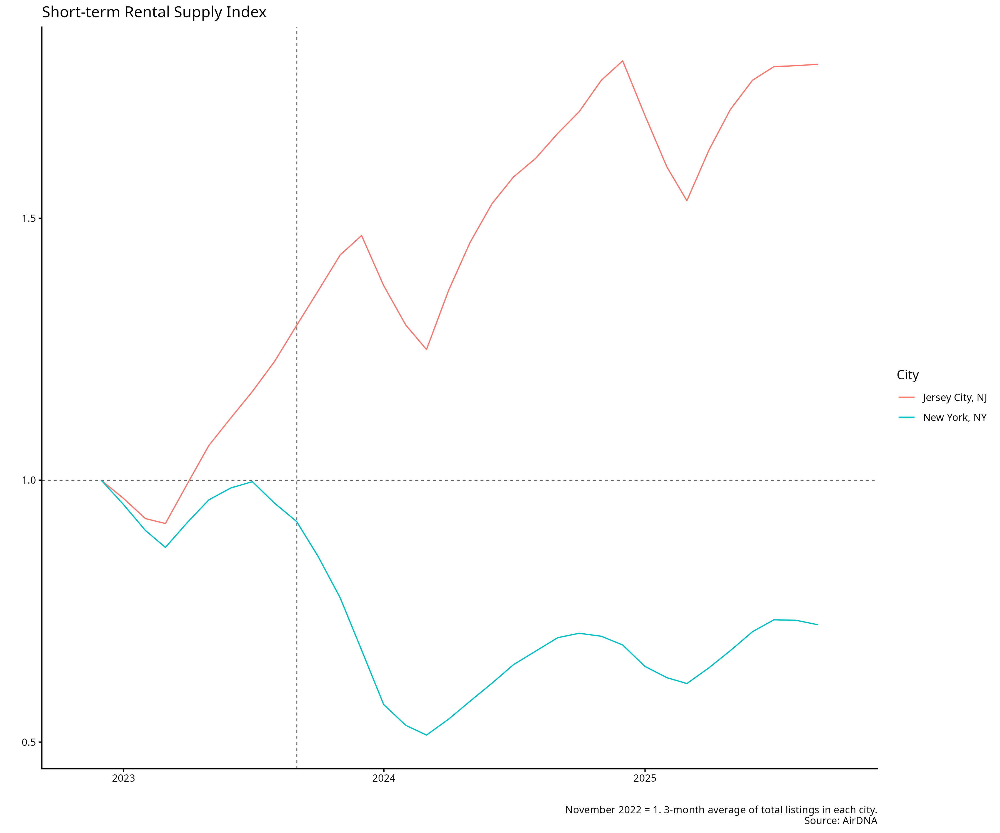

## Job Market Paper

### Plain Language Summary

Many cities have implemented regulations limiting short-term rentals (like Airbnb) in hopes of improving housing affordability. The intuition seems straightforward: if hosts can't rent out their properties on Airbnb, they'll rent them to long-term residents instead, increasing housing supply and lowering rents.

However, this policy largely fails because of **spatial substitutability** - when one neighborhood restricts short-term rentals, hosts simply shift their activity to nearby unrestricted areas. Rather than converting their properties to long-term rentals, property owners in restricted areas often keep them as short-term rentals by listing them in adjacent neighborhoods where regulations are weaker or unenforced.

Using detailed data from New York City, I show that:

1. When regulations tighten in one area, short-term rental supply increases in nearby areas
2. The net effect on long-term housing supply is minimal
3. Regulations primarily redistribute short-term rental activity rather than reducing it
4. For regulations to be effective, they need to be implemented at a much broader geographic scale

The key insight is visualized in the figure below, which shows how short-term rental supply shifts spatially in response to local regulations:

**Implication for policy**: Local Airbnb regulations are unlikely to improve affordability unless implemented regionally or at the city-wide level. Neighborhood-level regulations simply push the problem elsewhere.
