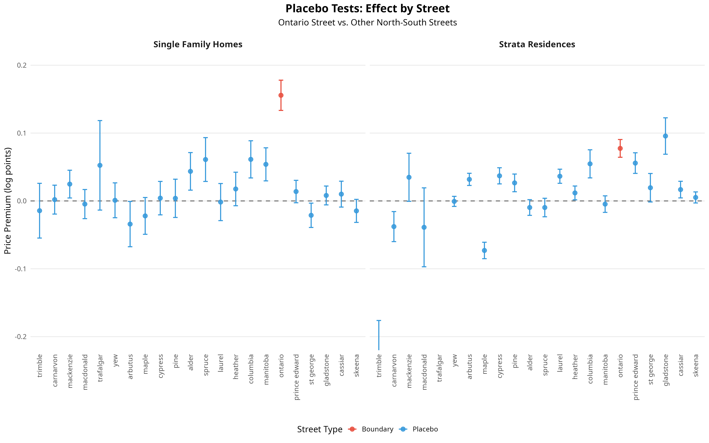

## With Sanghoon Lee and Seung Hoon Lee
**Revise and Resubmit, Journal of Urban Economics**

### Plain Language Summary

How much is a prestigious address worth? While we know that neighborhood characteristics like schools and amenities affect home prices, this paper asks a different question: do people pay a premium simply to live on a street with a prestigious name or location, even after controlling for all other neighborhood qualities?

We study this question in Vancouver, where Ontario Street serves as a prominent east-west boundary in the city. Using detailed housing transaction data, we compare homes that are nearly identical in all respects - they're the same distance from downtown, have similar access to amenities, and face the same local conditions - except that some are just north of Ontario Street while others are just south of it.

**Key findings:**

1. Homes north of Ontario Street sell for about **15% more** than comparable homes south of the street
2. This premium exists even after controlling for all measurable neighborhood characteristics
3. The premium appears to reflect pure "prestige" - the social cachet of being in a more desirable area

The figure below shows our main result. We compare the price premium at Ontario Street (the filled dot) to similar boundaries at other streets in Vancouver (the empty circles). Ontario Street shows a large, statistically significant premium, while the placebo streets show no systematic price differences:

**Why does this matter?**

Understanding prestige premiums has important implications for housing policy and urban development. If homebuyers pay substantial premiums for prestige rather than tangible amenities, this suggests:
- Neighborhood reputations can become self-reinforcing and difficult to change
- Efforts to improve struggling neighborhoods may face headwinds from reputation effects
- Housing affordability challenges may be partly driven by the geographic concentration of prestige

This research helps us understand that "location, location, location" isn't just about physical amenities - it's also about social perceptions and neighborhood identity.
