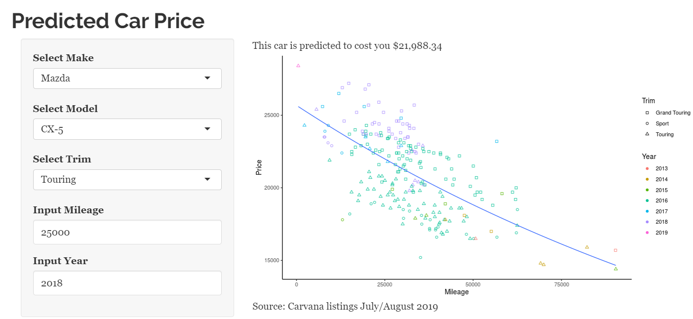

[Carvana App](https://dblarsen.shinyapps.io/carvana/)

[row]
[col]

[/col]
[/row]

Uses regression analysis to estimate predicted price for a car of certain make, model, mileage, and year.

Data scraped from Carvana using Python. Cleaned and analyzed using R and Stata.
